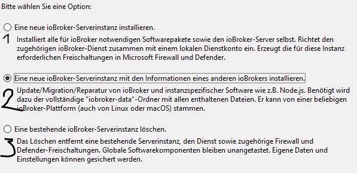

# Research
## First Steps
### Download IOBroker
IOBroker can be installed to Windows via installationwizard found here: [Wizard](https://www.iobroker.net/?page_id=4284&lang=de#de/download)

For Docker and RASP PI installations wizard can also be found on the webside above.

### Update IOBroker instance
After the download you have a IOBroker instance with an depricated Admin, NodeJS, Controller and other adapter. To download the KNX-Adapter we need a newer version of the JS-Controller, in order to do so we need to upgrade NodeJS first.
First we need to stop the current IOBroker instance in the IOBroker CMD. This CMD can be opened vie the searchbar. Just type IOBroker and choose IOBroker(Instancename) CMD. 
To stop you type:
`Iobroker stop`
2022-08-29 08:39:17,058 INFO  - Stopping the service with id 'iobroker(test)' **right output**

Now we can download a new version of NodeJS, preferable 16.x [link to NodeJS](https://nodejs.org/en/download/)
[link to test](Test)

Now we change the name of the current NodeJS in the IOBroker instance directory to "NodeJSBackUp" or anything else. After that you can insert the just downloaded NodeJS. The most important step now is to coüy the nodevars.bat from the NodeJSBackUp into the new NodeJS folder. This file is for the IOBroker CMD commands.
Now we have to run the installation wizard again and choose the secon option and "repair" the instance. The File wanted can be found under /IOBroker/instanceName/iobroker-data

In order to update the adapter via Webinterface we have to Update the JS-Controller in the IOBroker CMD.
First try IObroker Upgrade self, if it's not working try `npm install iobroker.js-controller@3.2`.
Then try `IOBroker Upgrade Self` again
To again just type `Iobroker start`
2022-08-29 09:05:07,156 INFO  - Starting the service with id 'iobroker(test)' **Right Output**

Now you can update all other Adapter via the Webinterface.

## Problems
### IOBroker CMD Commands not Working
Most times this is the result of a missing nodevars.bat after updating NodeJS. This could be found in the BackUp-folder of NodeJS or in a freshly set up IOBroker instance. Even if it's working after pasting the nodevars.bat into the NodeJS-Folder you should rerun the Installer on the second option.

