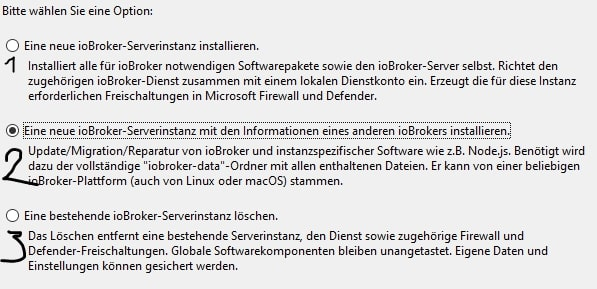

# Research
## table of content
- [Good to Know](#good-to-know)
- [First Steps](#first-steps)
- [Problems](#problems)
- [Node-Red](#node-red)
# Good to Know
### KNX
It's a well known facility bus. It knows Aktors (like little bridges that give the power to the light/mic/etc. which react to telegrams that come via the second connection of the bus:
~~~
            |¯¯¯¯¯¯¯¯¯¯¯¯¯¯¯¯¯Datenübertragung (Telegram, von Sensor o. PC)
     Ø-----|Aktor|----Strom-----
            |________________       
~~~
With one Bus you can have 15 "Floors", 15 "Rooms" or "Lines" and 255 Users.

### Packet Strucktur (German):

>     Oktet aus Kontrollbyte mit Priorisierung (00 Systemfunktion, 10 Alarmfunktion, 01 Hohe Prio, 11 norm Prio)
>     2 Byte für die Quelladresse (<xxxx><xxxx><xxxxxxxx>, <Bereich><Linie><Teilnehmer>)
>     2 Byte für die Zieladresse, Im ersten Bit steht drin ob unicast oder Multicast, die nächsten 4 sind für die Hauptgruppe. 3 Bit für die Mittelgruppe und wieder 4 für die Untergruppe.
>     1 Byte für das DRL-Byte (Destination-adress-flag, Routing-Counter, length), erstes Bit ist für die physische oder Gruppenadresse, 3 Bit werden als Counter genutzt, ist dieser über 7 wird das Paket
>     beliebig oft weitergeschickt, ist dieser 6 wird das Packet bei jedem Linien- und Bereichkoppler dekrementiert, bei 0 Wird dieses verworfen
>     4 Bit der DRL werden für die Länge -2 verwendet (in Bytes)
>     Byte 6 und 7 sind für Transport Protokole und die Application Protokol(DPT oder EIS) sowie ein Teil der Daten
>     Byte 8...n-1 sind die Daten
>     der letze Byte beinhaltet die Checksum (invertiertes, Bitweise XOR-Verknüpfung aller vorher gesendeter Pakete)
### IO-Broker
IOBroker is like a bridge between the diffrent scripts, busses, users, etc. It has adapter for various features such as KNX, Node-Red, Blockly, VIS, Weatherstations, various personal Assistants (Alexa).
It also has an own "datacoordination" so you can capsulate each adapter and don't have to juggle with variables between adapters.

# First Steps
### Download IOBroker
IOBroker can be installed to Windows via installationwizard found here: [Wizard](https://www.iobroker.net/?page_id=4284&lang=de#de/download)

For Docker and RASP PI installations wizard can also be found on the webside above.

### Update IOBroker instance
After the download you have a IOBroker instance with an depricated Admin, NodeJS, Controller and other adapter. To download the KNX-Adapter we need a newer version of the JS-Controller, in order to do so we need to upgrade NodeJS first.
First we need to stop the current IOBroker instance in the IOBroker CMD. This CMD can be opened vie the searchbar. Just type IOBroker and choose IOBroker(Instancename) CMD.
To stop you type:
`Iobroker stop`
2022-08-29 08:39:17,058 INFO  - Stopping the service with id 'iobroker(test)' **right output**

Now we can download a new version of NodeJS, preferable 16.x [link to NodeJS](https://nodejs.org/en/download/)

Now we change the name of the current NodeJS in the IOBroker instance directory to "NodeJSBackUp" or anything else. After that you can insert the just downloaded NodeJS. The most important step now is to coüy the nodevars.bat from the NodeJSBackUp into the new NodeJS folder. This file is for the IOBroker CMD commands.
Now we have to run the installation wizard again and choose the secon option and "repair" the instance. The File wanted can be found under /IOBroker/instanceName/iobroker-data

In order to update the adapter via Webinterface we have to Update the JS-Controller in the IOBroker CMD.
First try IObroker Upgrade self, if it's not working try `npm install iobroker.js-controller@3.2`.
Then try `IOBroker Upgrade Self` again
To again just type `Iobroker start`
2022-08-29 09:05:07,156 INFO  - Starting the service with id 'iobroker(test)' **Right Output**

Now you can update all other Adapter via the Webinterface.

# Problems
### IOBroker CMD Commands not Working
Most times this is the result of a missing nodevars.bat after updating NodeJS. This could be found in the BackUp-folder of NodeJS or in a freshly set up IOBroker instance. Even if it's working after pasting the nodevars.bat into the NodeJS-Folder you should rerun the Installer on the second option.

# Node-Red
## Whats it good for?
With Node-Red you can theoratically schedule tasks but also build an interface which then starts tasks. It's flow based as well as Webbased.
## Nodes and Stuff
What are Nodes? - Nodes are everything you can connect with wires, or everything that brings something into the flow, does something or brings something out of the flow.

These Nodes can be connected which basically tells the data-object where to go next. The standard name for this object is msg, if you want to send one or more data to next node you use the msg.payload field.

Important is also to deploy the flow before testing, as changes only apply after deployment.

Links to Node-Description:
### Common
- [Inject-Node](#inject-node)
- [Debug-Node](#debug-node)
- [Complete-Node](#complete-node)
- [Catch-Node](#catch-node)
- [Status-Node](#status-node)
- [Link-in-Node](#link-in-node)
- [Link-call-Node](#link-call-node)
- [Link-out-Node](#link-out-node)
- [Comment-Node](#comment-node)

### Function
- [Function-Node](#function-node)
- [Switch-Node](#switch-node)
- [Change-Node](#change-node)
- [Range-Node](#range-node)
- [Template-Node](#template-node)
- [ ] not done
- [Delay-Node](#delay-node)
- [ ] not done
- [Trigger-Node](#trigger-node)
- [ ] not done
- [Exec-Node](#exec-node)
- [ ] not done
- [Filter-Node](#filter-node)
- [ ] not done

### Network
- [ ] not done

### Sequence
- [Split-Node](#split-node)
- [ ] not done
- [Join-Node](#join-node)
- [ ] not done
- [Sort-Node](#sort-node)
- [ ] not done
- [Batch-Node](#batch-node)
- [ ] not done

### Parser
- [ ] not done

### Storage
- [ ] not done

### Analysis
- [ ] not done

### Social
- [ ] not done

### Advanced
- [ ] not done

### IOBroker
- [ ] not done

### Operating Systemfunktion
- [ ] not done

### Polymer
- [ ] not done

### Dashboard
- [ ] not done

## Common
### Inject-Node

With this Node you can "inject" a specific message into the flow, this can be once, by clicking the fild left to the node when deployed, repeated, repeated in a specific timeframe or at a specific time.

You can define the payload but also other Objectfields can be added, at the bottom you can configurate if or when to repeat the injection.

### Debug-Node

This node can write to the console on the right of the flow, or to the Debug-console. Here you can check if your Object are built right or if the Object has some mistakes in it.

First you can decide which attribute or field should be printed, then where this should be printed.

### Complete-Node

This Node triggers when another node completes it's operation.
No need for pictures or anything, just check the node that should have finished it's action to start this node.

### Catch-Node

Again no big need to explain a lot, it catches appearing errors, you can change which nodes errors should be caught and also if the flow should be forced to continue.

### Status-Node

With this node you can show specific status information like connected and such in the UI.
### Link-in-Node

This node, together with the Link-Out-node can transfer Data between flows via Node-Red. In the Interface you can see every Link-Out and in the link-out-nodes you can see all link-out-nodes, that's why it's important to give these names.

### Link-call-Nodes

This can be used to quickly add a function into a flow with just a call. The node calls the Link-Out-Node which you picked and starts at the Link-In-Node of that subflow like this:

### Link-out-Node

Now this node is used to push data out of the flow into another flow with a link in Node.
### Comment-Node

It is what it says, a comment.

## function
### Function-Node

In this Node you can write JS-Code. There are 4 Tabs: Setup for different Modules.  
On Start for whenever the Node gets called.  
On Message for the main code.  
On Stop for all Code that should be done when the Node is done.
More about writing the code can be found here: [Function-Writing](https://nodered.org/docs/user-guide/writing-functions)

### Switch-Node

This node works like a Java-Switch-Case, so it looks at a value and decides by that what should happen next.

### Change-Node

Most common use for this node is to set the Value of a variable in this scope or context (At least each flow for itself, Global stays global)
It can also be used to change the value, delete it or move it from on Variable to another.

### Range-Node

Works like a Map in c++, you can take a range of numbers and rescale it to another range. Lets say you have an array with number from 1 to 250, now you want to show it as percentage so you map the second range from 1 to 100.

### Template-Nodes
  

Here can text be generated by using the Mustache templating language [More](https://mustache.github.io/mustache.5.html)

## First Example - multiplication of two variable put in by the User
This is a good example to analyze the variable concept of Node-Red as well as a bit of Visualization via Node-Red.

Important here is to join the two msg.payload from the numeric nodes to one single msg.payload. In the join you have to set the field "After a number of message parts" to 2.
the code in the function node should look somewhat like this:
~~~javascript
var num1 = msg.payload[0];
var num2 = msg.payload[1];
var calc = num1 * num2;
msg.payload = calc;
return msg;
~~~
you would'nt have to declare two new variable but for readability i did it. As mentioned before it is importent to save data that has to be used by the next node in the msg.payload variable.
As Node-Red only send Objects between nodes you can't just send the number.

In case you can't see your widget nodes on the Dashboard make sure to have chosen the right tab an group in the group field of visualization nodes (numeric-input, text-output, gauge, etc.).
# TODO
- [ ] nodes erklären
- [ ] mehr auf Function eingehen
- [ ] mehr auf template eingehen
- [ ] Visualisierung mit groups usw erklären
- [ ] Dateiverkehr zwischen node
- [ ] Dateiverkehr zwischen Adaptern
Ctrl+Shift+M
