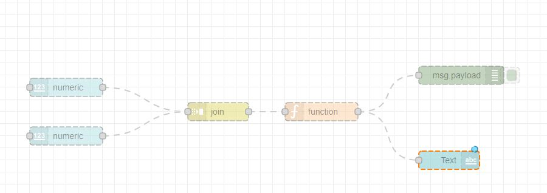
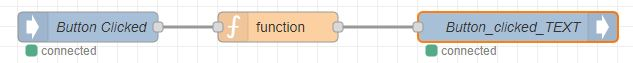
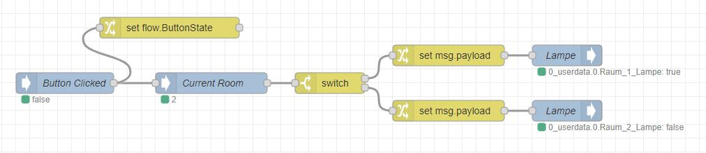

# Research
## table of content
- [Good to Know](#good-to-know)
- [First Steps](#first-steps)
- [Problems](#problems)
- [IOBroker](#iobroker)
- [Node-Red](#node-red)
# Good to Know
### KNX
It's a well known facility bus. It knows Aktors (like little bridges that give the power to the light/mic/etc. which react to telegrams that come via the second connection of the bus:
~~~
            |¯¯¯¯¯¯¯¯¯¯¯¯¯¯¯¯¯Datenübertragung (Telegram, von Sensor o. PC)
     Ø-----|Aktor|----Strom-----
            |________________       
~~~
With one Bus you can have 15 "Floors", 15 "Rooms" or "Lines" and 255 Users.

### Packet Strucktur (German):

>     Oktet aus Kontrollbyte mit Priorisierung (00 Systemfunktion, 10 Alarmfunktion, 01 Hohe Prio, 11 norm Prio)
>     2 Byte für die Quelladresse (<xxxx><xxxx><xxxxxxxx>, <Bereich><Linie><Teilnehmer>)
>     2 Byte für die Zieladresse, Im ersten Bit steht drin ob unicast oder Multicast, die nächsten 4 sind für die Hauptgruppe. 3 Bit für die Mittelgruppe und wieder 4 für die Untergruppe.
>     1 Byte für das DRL-Byte (Destination-adress-flag, Routing-Counter, length), erstes Bit ist für die physische oder Gruppenadresse, 3 Bit werden als Counter genutzt, ist dieser über 7 wird das Paket
>     beliebig oft weitergeschickt, ist dieser 6 wird das Packet bei jedem Linien- und Bereichkoppler dekrementiert, bei 0 Wird dieses verworfen
>     4 Bit der DRL werden für die Länge -2 verwendet (in Bytes)
>     Byte 6 und 7 sind für Transport Protokole und die Application Protokol(DPT oder EIS) sowie ein Teil der Daten
>     Byte 8...n-1 sind die Daten
>     der letze Byte beinhaltet die Checksum (invertiertes, Bitweise XOR-Verknüpfung aller vorher gesendeter Pakete)
### IO-Broker
IOBroker is like a bridge between the diffrent scripts, busses, users, etc. It has adapter for various features such as KNX, Node-Red, Blockly, VIS, Weatherstations, various personal Assistants (Alexa).
It also has an own "datacoordination" so you can capsulate each adapter and don't have to juggle with variables between adapters.

# First Steps
### Download IOBroker
IOBroker can be installed to Windows via installationwizard found here: [Wizard](https://www.iobroker.net/?page_id=4284&lang=de#de/download)

For Docker and RASP PI installations wizard can also be found on the webside above.

### Update IOBroker instance
After the download you have a IOBroker instance with an depricated Admin, NodeJS, Controller and other adapter. To download the KNX-Adapter we need a newer version of the JS-Controller, in order to do so we need to upgrade NodeJS first.
First we need to stop the current IOBroker instance in the IOBroker CMD. This CMD can be opened vie the searchbar. Just type IOBroker and choose IOBroker(Instancename) CMD.
To stop you type:
`Iobroker stop`
2022-08-29 08:39:17,058 INFO  - Stopping the service with id 'iobroker(test)' **right output**

Now we can download a new version of NodeJS, preferable 16.x [link to NodeJS](https://nodejs.org/en/download/)

Now we change the name of the current NodeJS in the IOBroker instance directory to "NodeJSBackUp" or anything else. After that you can insert the just downloaded NodeJS. The most important step now is to coüy the nodevars.bat from the NodeJSBackUp into the new NodeJS folder. This file is for the IOBroker CMD commands.
Now we have to run the installation wizard again and choose the secon option and "repair" the instance. The File wanted can be found under /IOBroker/instanceName/iobroker-data

In order to update the adapter via Webinterface we have to Update the JS-Controller in the IOBroker CMD.
First try IObroker Upgrade self, if it's not working try `npm install iobroker.js-controller@3.2`.
Then try `IOBroker Upgrade Self` again
To again just type `Iobroker start`
2022-08-29 09:05:07,156 INFO  - Starting the service with id 'iobroker(test)' **Right Output**

Now you can update all other Adapter via the Webinterface.

# Problems
### IOBroker CMD Commands not Working
Most times this is the result of a missing nodevars.bat after updating NodeJS. This could be found in the BackUp-folder of NodeJS or in a freshly set up IOBroker instance. Even if it's working after pasting the nodevars.bat into the NodeJS-Folder you should rerun the Installer on the second option.

## What is IOBroker?
It is a free Open Source software to combine different Smart-Home and IoT devices into one big system. It has a global datasystem and a grafical interface to simplify the usage of the application.

## Adapter
Adapter are like mods you can add to controll different devices with different communication protocols. For example:
- Alexa
- KNX
- Node-RED
- Discovery (Was used to find devices in the network)
- Admin (for different user privileges)
- JavaScript (With blockly and normal, to create predefined Scripts)
- ...

Installation of the adapter can be done in the Adapter-Tab as well as over the IOBroker-CMD. Over Webinterface it is a lot easier, just look up the desired Adapter and download it. It will create a Instance of the adapter, some can have more instances.

## compatibility
It can be installed on SoC-Single Card Computers (RaspPi, OrangePi, usw. ) or on Desktop-PC with Linus, Windows (A big fight but possible) even Docker is possible.

## Datastructure
As said we have a global datasystem to use in ever Adapter. In NodeRed we have an IOBRoker in and out Node to use this Datasystem. It can be found under Obejct in the Webinterface. There can be found 9 icons on top of the datatree.

1. is to refresh
2. is for visual purpose
3. We have close all currently open folder or knots
4. Open one layer of the current folder
5. Close one layer of the current folder
6. Change Status view (Who changed it, is it an original status or just a rewritten one like when translating a bool to text via function in NodeRed, When was the last change)
7. Add a Datapoint, folder or other data Structure
8. Upload a Json
9. Download a Json

## instances

These are installed Adapter which can be started or paused to save RAM. Every Instance needs a base rate of RAM so it is important to disable instances you don't need like the discovery or the Javascript-Adapter as long you don't use it.

## Logs
In this Tab you can see all Errors, logs or just info for your installed instances.

## Users
important to know is that user itself don't have permissions but the groups they are in, so always keep that in mind and everything else is self explainatory.

## Migrating

Basically you should only migrate on the same OS as it was before, if not possible you should set up a new Server. 
Or we use the BackItUp-Adapter, this one only saves the "blueprint", so theoretical it should work but not tested.

# Node-Red
## Whats it good for?
With Node-Red you can theoratically schedule tasks but also build an interface which then starts tasks. It's flow based as well as Webbased.
## Nodes and Stuff
What are Nodes? - Nodes are everything you can connect with wires, or everything that brings something into the flow, does something or brings something out of the flow.

These Nodes can be connected which basically tells the data-object where to go next. The standard name for this object is msg, if you want to send one or more data to next node you use the msg.payload field.

Important is also to deploy the flow before testing, as changes only apply after deployment.
[NODES](Nodes.md)

## First Example - multiplication of two variable put in by the User
This is a good example to analyze the variable concept of Node-Red as well as a bit of Visualization via Node-Red.

Important here is to join the two msg.payload from the numeric nodes to one single msg.payload. In the join you have to set the field "After a number of message parts" to 2.
the code in the function node should look somewhat like this:
~~~javascript
var num1 = msg.payload[0];
var num2 = msg.payload[1];
var calc = num1 * num2;
msg.payload = calc;
return msg;
~~~
you would'nt have to declare two new variable but for readability i did it. As mentioned before it is importent to save data that has to be used by the next node in the msg.payload variable.
As Node-Red only send Objects between nodes you can't just send the number.

In case you can't see your widget nodes on the Dashboard make sure to have chosen the right tab an group in the group field of visualization nodes (numeric-input, text-output, gauge, etc.).

## Show Status - a simple Template

Status of light or such might be be better in text if given back to user so we have to somehow translate from a boolean to a text. With just 3 Nodes it is possible and we can even decide which message should be given back. We need an IObroker-In Node, a function Node and an IOBroker-out node assembeled like this:

We give in the specific bool we want to translate. In the function Node we have this code:
~~~
var indi = msg.payload;
if(indi == "true"){
    msg.payload = "Geklickt";
}
if (indi == "false") {
    msg.payload = "nicht Geklickt";
}
return msg;
~~~
Important is to compare the true/false String instead of the bool-value. This msg gets into a IOBRoker-Out node which writes it to a newly created Datapoint which can then be connected in the VIS-View. This is pretty easy, you just take a String field in the Edit Vis and set the field Object ID to the new Datapoint.

This Datapoint can be created in IOBroker/Objects in the folder 0_userdata/0

## Using more than one Room

For this create a Variable to save the room. A dropdown in VIS. Connect them.
Flow looks like this:

We set the ButtonState as this is acording to the image in Vis. Current Room gets set by the Vis, as these Values are 1,2,3,... we can work with a simple switch. On every Output we then have to set the payload again to ensure to have the right one. Here we set it to the previous set flow.ButtonState. Then we set the lamp variable (or the real lamp) to on or off, acording to incoming ButtonState.

# React
 
 For Frontend i decidet for the React framework NextJS. This has an efficiant way of datahandling and is also well used in the industry which gives a lot of patches and new stuff to use. This way we have a Webside in the end which could be called from anywhere and it should be easy to use it around the whole campus. 

 The language React is based on is JavaScript, an also well used language as well, what makes learning react and its Frameworks easy and more efficiant. It is important to at least know something about React before continuing to NextJS as it uses a lot of the practices used in React.

More to React and its practices [here](React.md)